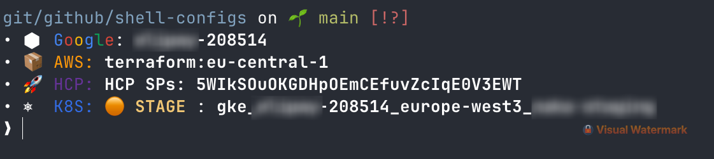

# 🚀 Shell Configs for Cloud/DevOps Engineers

Multi-cloud shell prompt configuration that displays your active cloud contexts at a glance. Built with [Starship](https://starship.rs/) for speed and reliability.

## Features

- **Multi-Cloud Detection**: Automatically displays GCP, AWS, Azure, and HCP/Terraform Cloud contexts
- **Kubernetes Environment Awareness**: Shows cluster, context, and environment (PROD/STAGE/DEV) with visual indicators
- **Fast & File-Based**: No slow CLI calls - reads directly from config files for instant updates
- **Color-Coded**: Environment-aware colors (🔴 PROD, 🟠 STAGE, 🟢 DEV)
- **Minimal Dependencies**: Works with just Starship; optional `jq` for enhanced Azure/HCP parsing

## Screenshot



Your prompt displays:
- **Directory & Git**: Current path with branch and status
- **Cloud Contexts**: All active cloud provider configurations
- **Kubernetes**: Cluster and environment with color-coded indicators

## Quick Start

### 1. Install Starship

```bash
# macOS
brew install starship

# Linux
curl -sS https://starship.rs/install.sh | sh
```

### 2. Install Configuration

```bash
# Clone repository
git clone https://github.com/Timotej979/shell-configs.git ~/.shell-configs

# Backup existing config (if any)
[ -f ~/.config/starship.toml ] && mv ~/.config/starship.toml ~/.config/starship.toml.backup

# Create symlink
mkdir -p ~/.config
ln -sf ~/.shell-configs/starship.toml ~/.config/starship.toml
```

### 3. Initialize Starship

Add to your shell config file:

**Bash** (`~/.bashrc`):
```bash
eval "$(starship init bash)"
```

**Zsh** (`~/.zshrc`):
```bash
eval "$(starship init zsh)"
```

**Fish** (`~/.config/fish/config.fish`):
```fish
starship init fish | source
```

### 4. Restart Shell

```bash
exec $SHELL
```

## Supported Cloud Providers

### ☁️ Google Cloud Platform
- Reads from `~/.config/gcloud/configurations/config_*`
- Shows active project
- Displays with colored Google logo

### 📦 AWS
- Parses `~/.aws/config` and `~/.aws/credentials`
- Shows all configured profiles with their regions
- Respects `$AWS_PROFILE` environment variable

### 💠 Azure
- Reads from `~/.azure/azureProfile.json`
- Displays active subscription name
- Requires `jq` for JSON parsing (optional)

### 🚀 HashiCorp Cloud Platform / Terraform Cloud
- Detects `~/.terraform.d/credentials.tfrc.json` (Terraform Cloud)
- Reads `~/.config/hcp/creds-cache.json` (HCP)
- Shows configured hosts and service principals

### ⎈ Kubernetes
- Reads from `$KUBECONFIG` or `~/.kube/config`
- Shows current context and cluster
- Auto-detects environment from context name:
  - 🔴 **PROD** (production)
  - 🟠 **STAGE** (staging)
  - 🟢 **DEV** (development)
  - 🟢 **ITE** (integration test environment)

## Optional Dependencies

- **`jq`**: Enhances Azure and HCP credential parsing
  ```bash
  # macOS
  brew install jq
  
  # Debian/Ubuntu
  apt install jq
  ```

## Configuration

The `starship.toml` is well-commented and customizable. Key settings:

- **Timeout**: Commands complete within 200ms
- **Format**: Directory → Git → Cloud Contexts → Kubernetes → Prompt
- **Colors**: True color support for brand-accurate logos

## Troubleshooting

**Prompt not showing clouds?**
```bash
# Verify config location
echo $STARSHIP_CONFIG

# Check cloud CLI configs exist
ls -la ~/.aws/config ~/.config/gcloud/configurations/
```

**Azure/HCP not appearing?**
```bash
# Install jq for JSON parsing
brew install jq  # or apt install jq
```

**Slow prompt?**
- This config is optimized for speed (file-based parsing)
- Check `command_timeout` setting in `starship.toml`

## Contributing

Contributions welcome! Ideas:
- Additional cloud providers (DigitalOcean, Oracle Cloud, etc.)
- Shell aliases for cloud operations
- Performance improvements

## License

MIT License - see [LICENSE](LICENSE) for details.

## Author

**Timotej Petrovcic** - [@Timotej979](https://github.com/Timotej979)

---

⭐ Star this repo if you find it useful!
